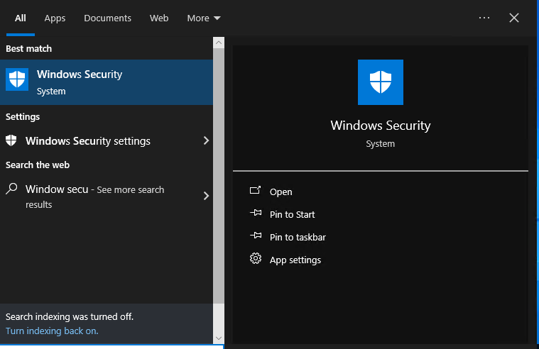
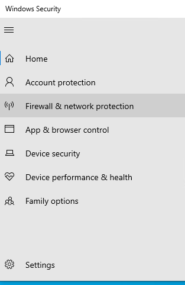

# Enabling-And-Configuring-Operating-System-Firewall
Operating System Firewall Setup and Configuration, a project that showcase best practices for enabling and configuring operating system firewalls for robust security measures to safeguard systems and networks.

To get started, access your operating system’s firewall settings by following these steps:

1. Open the Settings menu, then navigate to the Window Security section and click on it.

2. Go to Window Security and check the Firewall & Network Protection settings to make sure the firewall is turned on.
 
