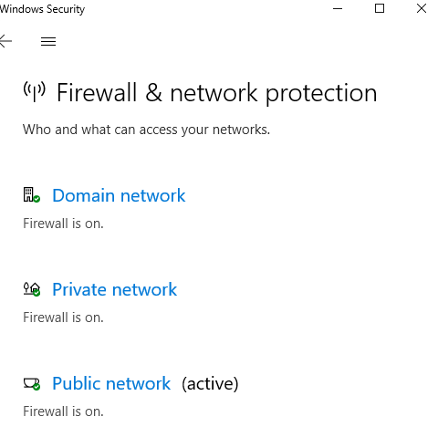
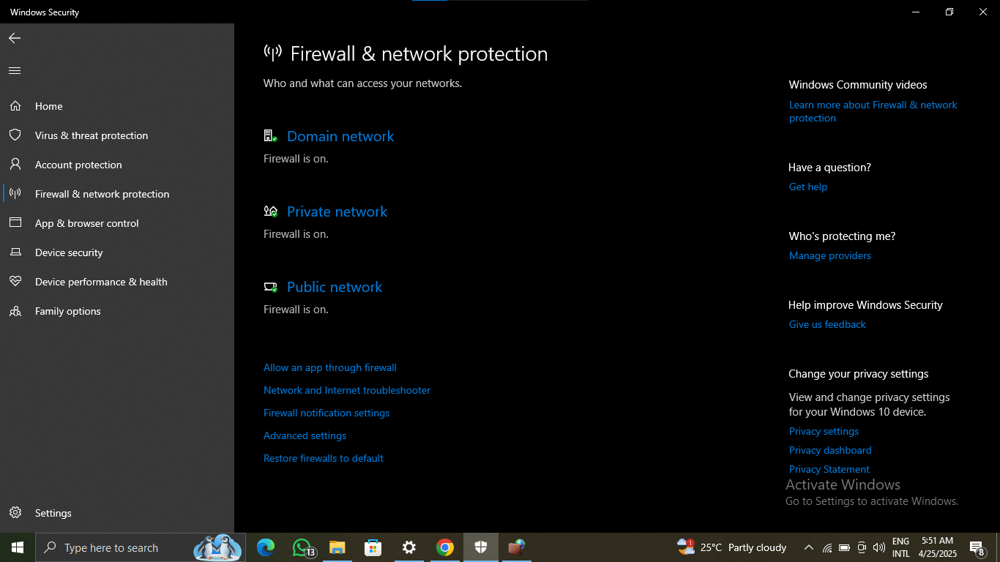
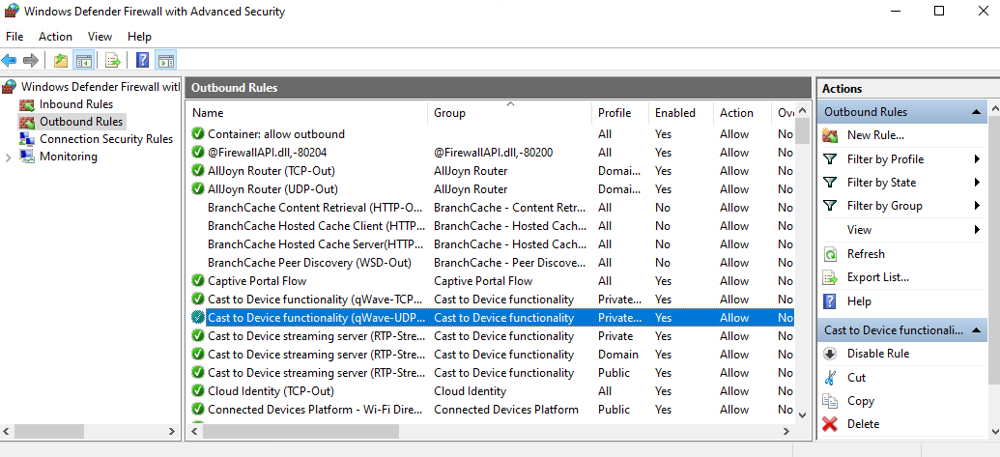
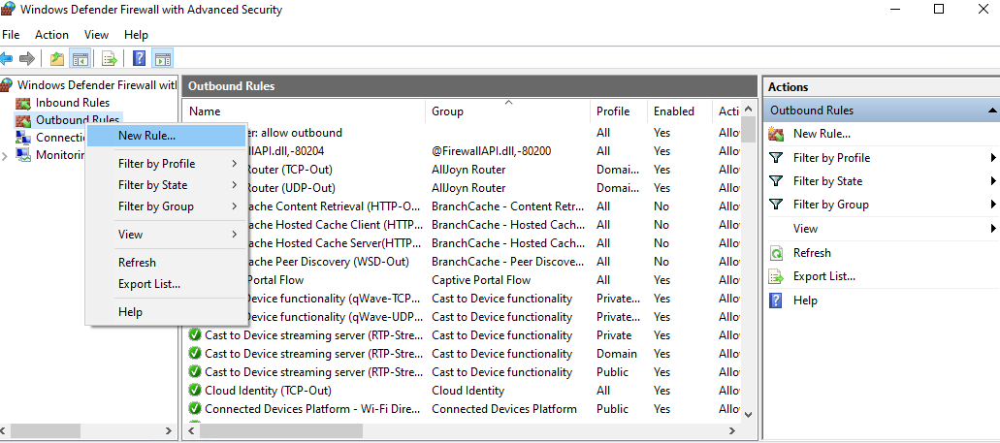
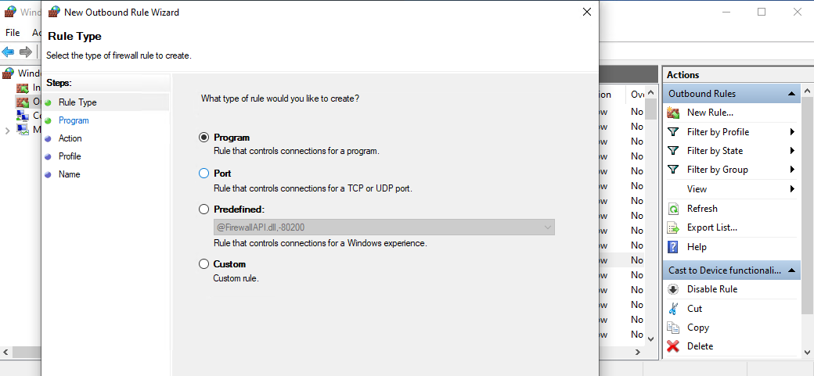
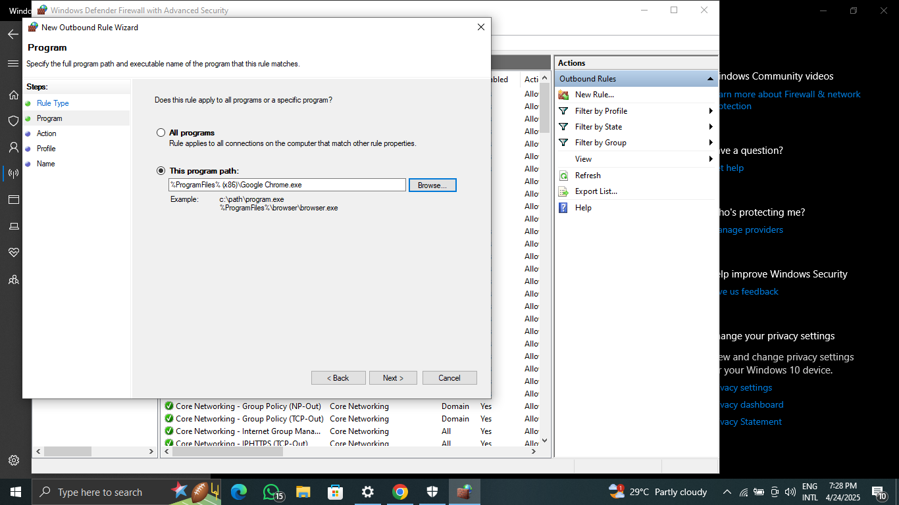
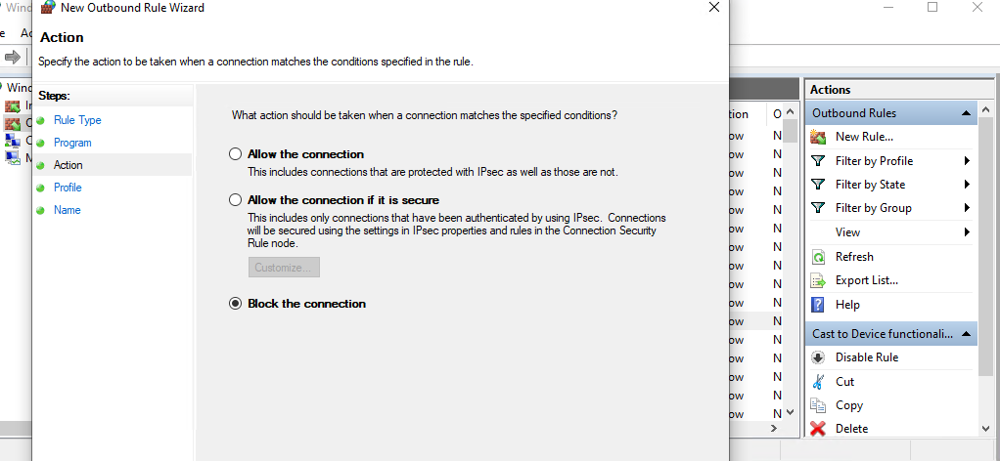
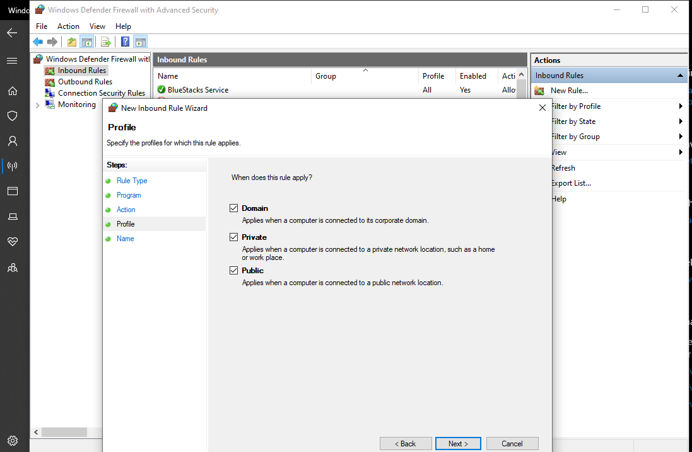
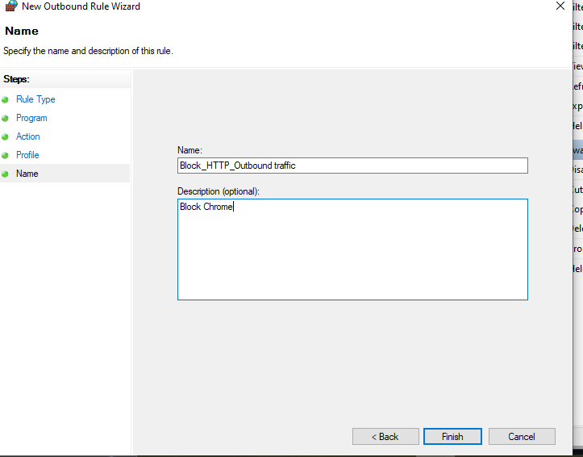

# Enabling-And-Configuring-Operating-System-Firewall
This project demonstrates the steps to enable and configure the operarting system firewall on Window. The goal of this project is to provide comprehensive guide on securing window by configuring the firewall to allow or block incoming and outgoing network traffic:

What is a Firewall?
A firewall is a system that is designed to prevent unauthorized access to entering a private network by filitering the information that comes in from the internet. 
The purpose of a firewall is to create a safety barrier between a private network and a public network.

Project Overview
In this project, i will walk through the process of:

1. Enabling the window operating system firewall to improve security
2. Configuring firewall rules
3. Allowing or blocking programs and applications. 

To get started, access your operating system’s firewall settings by following these steps:

1. Open the Settings menu, then navigate to the Window Security section and click on it.

2. Go to Window Security and check the Firewall & Network Protection settings to make sure the firewall is turned on.
 
If it's not turned on, click the Enable or Turn On button.
 
 
 Step 2: Configuring basic Firewall
 
 1. Go to the firewall settings and find Advanced Settings.
 

 2. You'll see three types of network profiles: Public, Private, and Domain. Pick the one you want to change.

3.  Decide whether you want to block traffic coming in (incoming) or going out (outgoing).
 
  
4.  On the right side, click New Rule.
 
 
5. You can create a rule for a program, a specific port, a website address (HTTP), or make your own custom rule. Click on program

 
7. Next, choose which app you want the rule to apply to. For this example, Google Chrome is used as the web browser

8. When you get to the screen that asks what to do with the connection, choose Block the connection.

9. Click Next, then choose when the rule applies (Domain, Private, Public).

10. Give the rule a name (like "Block Google Chrome"), and click Finish.

   

 

